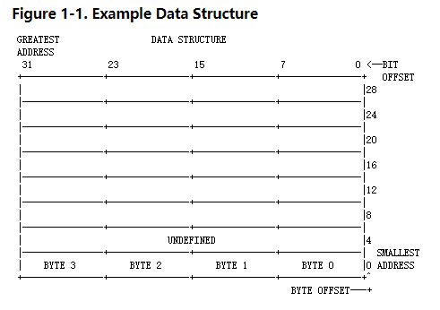

Introduction(介绍) to the 80386

```
The 80386 is an advanced(先进，高级) 32-bit microprocessor
(microprocessor  微处理器)
 optimized(最优化的 ) for multitasking (多任务处理) operating systems and designed for applications needing very high performance （high performance 高性能）.
 ccc for xxxxx  为 xxxxx  ccc  翻译顺序

 例：optimized for multitasking  operating systems
        为 多任务操作系统优化  


  The 32-bit registers and data paths support 32-bit addresses and data types. The processor can address up to four gigabytes(four gigabytes 4G) of physical memory and 64 terabytes(TB) (2^(46) bytes) of virtual memory. 
     处理器寻址最多寻址4G 物理内存 ，和最多64TB 的虚拟地址  
     4G 寻址地址是怎样计算的呢？
         在计算机中内存中最小的位宽为1byte
         
         1k=2^10 byte
         1m=2^10k
         1G=2^10m
         2^32 byte=2^22k=2^12m=2^2G=4G
         就是这样计算出来的

  The on-chip(chip 芯片) memory-management 
  facilities(  /fə'sɪlɪtɪz/  工具，设备) include address translation(翻译，转换) registers,
  芯片上的内存管理设备包含地址转换寄存器
  
  advanced multitasking hardware, a protection(保护) mechanism(机制，机构，原理), and paged virtual memory. Special debugging registers provide data and code breakpoints even in ROM-based software.
  
  芯片的内存管理工具包含地址转换寄存器， 先进的多任务硬件，保护机制和分页机制，虚内存，特殊的debug寄存器，event(甚至)在可读内存软件能够进行数据和代码的端点
```

### 1.1 Organization(组织,机构) of This Manual(adj 手工的  n 手册)
翻译： 手册的结构

```
   Part I      -- Applications Programming  第一部分引用程序
   Part II     -- Systems Programming 第二部分系统程序
   Part III    -- Compatibility  兼容性 /kəmˌpætəˈbɪləti/
   Part IV     -- Instruction Set 指令集
   Appendices  附加

   These divisions(dɪˈvɪʒnz  划分部分,分隔 )are determined(决定) in part by the architecture(架构 /ˈɑːkɪtektʃər/) itself and in part by the different ways the book will be used. 
   这划分部分由他自己的架构决定，部分由本书使用不同的方式
   
   As the following table indicates, the latter two parts are intended as reference material for programmers actually engaged in the process of developing software for the 80386.

   As the following  如下
   indicates 指示,显示  [ˈɪndɪkeɪts]

   actually 事实上
   
   engaged  v参加,雇佣，从事  adj 忙碌的

   intended 故意的,有意的   /ɪnˈtendɪd/
    
   as reference  material 参考材料

    翻译： 如下表指示 ，后面两部分，(for) 为了程序员 从事engaged  actualy实际 在80386处理器开发软甲 as  作为  参考材料

    The first three parts are explanatory, showing the purpose of architectural features,
      
      explanatory  /ɪkˈsplænətri/ 说明，解释 
      purpose    /ˈpɜːpəs/   用途

      The first three parts  前三部分

      features  /ˈfiːtʃəz/ 
                     n. 产品特点，特征；容貌；嘴脸（feature的复数）
                   v. 是…的特色，使突出（feature的第三人称单数）
      
      翻译   前三部分是解释说明，展示用途的建筑特征
     developing terminology and concepts, and describing instructions as they relate to specific purposes or to specific architectural features.
       terminology  /ˌtɜːmɪˈnɒlədʒi/  术语，用辞
       concepts  /ˈkɒnsɛpt/   概念，观念；思想
       relate to   /rɪˈleɪt/  涉及


       翻译：开发术语和概念描述，他们涉及特殊的用途或者特别的建筑特征相关指令


The first three parts follow the execution modes and protection features of the 80386 CPU. 
 
 翻译 前三部分介绍 80386cpu 执行模式和保护模式


The distinction between applications features and systems features is determined by the protection mechanism of the 80386. 

  distinction   /dɪˈstɪŋkʃn/   区别；差别；特性；荣誉、勋章
  mechanism   /ˈmekənɪzəm/   机制；原理，途径；进程；机械装置；技巧

 翻译： 应用程序特征和系统程序特征之间的差异是由80386保护模式机制决定的
One purpose of protection is to prevent applications from interfering with the operating system; 
    interfering  /ˌɪntəˈfɪərɪŋ/ adj. 干涉的；多管闲事的

    purpose  /ˈpɜːpəs/ n. 目的；用途；意志  vt. 决心；企图；打算
    prevent  预防，避免


    翻译：保护模式的第一个目的 预防应用程序干扰操作系统


therefore, the processor makes certain registers and instructions inaccessible to applications programs. 
    therefore  /ˈðeəfɔːr/  因此
    certain   /ˈsɜːtn/  某一；必然的；确信；无疑的；有把握的  pron. 某些；某几个
    inaccessible  /ˌɪnækˈsesəbl/  adj. 难达到的；难接近的；难见到的
    accessible  /əkˈsesəbl/  adj. 易接近的；可进入的；可理解的

翻译：
  因此 ，处理器使用的某一些寄存器和指令 应用程序不能够访问
The features discussed in Part I are those that are accessible to applications; 
    discussed  /dɪˈskʌst/   v. 讨论（discuss的过去分词）；商讨
    that 那些 
    第一部分商讨那些可以访问的引用程序的特征
   
the features in Part II are available only to systems software that has been given special privileges or in unprotected systems.

      available   /əˈveɪləbl/ adj. 可获得的；可购得的；可找到的；有空的，适用于
      privileges   /ˈprɪvəlɪdʒɪz/   n. [计] 特权（privilege的复数）    n. [计] 特权（privilege的复数）

      given   /ˈɡɪvn/  获得 赋予

    翻译  第二部分 仅适用于  才做系统被赋予可出的权限 或不受保护的系统


The processing mode of the 80386 also determines the features that are accessible. The 80386 has three processing modes:

80386 处理器模式决定可以访问的特征，80386有三种处理模式 

   1.  Protected Mode.保护模式
   2.  Real-Address Mode. 实模式
   3.  Virtual 8086 Mode. 虚拟模式


Protected mode is the natural 32-bit environment of the 80386 processor.
    natural   /ˈnætʃrəl/   adj. 自然的；物质的；天生的；不做作的   n. 自然的事情；白痴；本位音

    翻译：在80386处理器 自然的32位环境就是保护模式
 In this mode all instructions and features are available.

  翻译 在这个模式(保护模式) 所有指令和特征是可用的


Real-address mode (often called just "real mode") is the mode of the processor immediately after RESET.
    often   /ˈɒfn; ˈɒftən/   adv. 常常，时常；往往，大多
    immediately   /ɪˈmiːdiətli/    立即，立刻；直接地    conj. 一…就

    翻译；: 处理器重置之后立即就变成实模式
 In real mode the 80386 appears to programmers as a fast 8086 with some new instructions. 
  
  appears    /ə'pɪəs/    v. 出现；呈现；看上去好像

    to  有对于的意思

  翻译 80386出现了实模式  对于程序员像是一个提供一些新指令的一个快速的8086 

 Most applications of the 80386 will use real mode for initialization only.
    在80386中大多数应用程序使用实模式仅仅为了初始化


Virtual 8086 mode (also called V86 mode) is a dynamic mode in the sense that the processor can switch(交换，开关) repeatedly and rapidly between V86 mode and protected mode.

      sense   /sens/  n. 感觉，官能；观念；道理；理智    vt. 感觉到；检测
      in the sense  就....而言
      rapidly   /ˈræpɪdli/    adv. 迅速地；很快地；立即

      翻译 虚拟8086模式(也叫做V86模式),是一个动态模式，就动态模式而言就是说处理器能够反复快速的在V86(8086)虚拟模式和保护模式之间切换


 The CPU enters V86 mode from protected mode to execute an 8086 program, 
 CPU从保护模式进入v86模式执行一个8086程序
 then leaves V86 mode and enters protected mode to continue executing a native 80386 program.
      leaves    /liːvz/ v. 离开；让……留下 
      翻译: 甚至离开V86模式 进入到保护模式 继续执行一个本地(原生)的80386的程序


The features that are available to applications programs in protected mode and to all programs in V86 mode are the same.
        are the same  一样

        翻译： 这些特征 适用于 保护模式下的应用程序和在v86模式下的所有程序，都是一样的

 These features form the content of Part I. 
      form   /fɔːm/  构成

      翻译: 这些特征构成第一部分


 The additional features that are available to systems software in protected mode form Part II. 
       additional   /əˈdɪʃənl/    adj. 附加的，额外的

    翻译：  在保护模式下，额外添加新特征，构成第二部分
 Part III explains real-address mode and V86 mode, as well as how to execute a mix of 32-bit and 16-bit programs.      
      explains  /ɪkˈspleɪnz/    v. 解释；说明（explain的三单形式）
      mix    /mɪks/   v. （使）混和；配制；参与  n. 混合；良莠不齐；混合物；

      翻译  第三部分 解释了实模式和v86(virtual 8086 mode)  mode 怎样混合执行32位和16位的程序


Available in All Modes             Part I -- Applications Programming

Available in Protected             Part II -- Systems Programming
Mode Only

Compatibility Modes    兼容模式            Part III -- Compatibility
      Compatibility   /kəmˌpætəˈbɪləti/   n. [计] 兼容性


```  


###  1.1.1 Part I -- Applications Programming


```
This part presents those aspects of the architecture that are customarily used by applications programmers.
        presents   ˈpreznts/    n. 礼物（present 的复数）   v. 颁发；赠送；提交；展示；致谢
        those   那些（that 的复数）
        aspects    /'æspekts/   n. 方面；相位；面貌（aspect的复数 
        architecture  架构   /ˈɑːkɪtektʃər/
        customarily   ˈkʌstəmərəli/  adv. 通常，习惯上 

        翻译  这部分介绍应用软件程序员通常使用架构那方面
Chapter 2 -- Basic Programming Model: Introduces the models of memory organization. Defines the data types.
        翻译 章节二，基本编程模型，介绍内存管理组织模型，定义数据类型
 Presents the register set used by applications. 
      .......by xxx   ...xxx.........  xxx提前
    翻译：  展示一些应用程序，使用寄存器
 Introduces the stack. Explains string operations. Defines the parts of an instruction. 
        operations    /,ɑpə'reʃən/    n. 运营；运作；业务操作（operation的复数)
         axxxxx of  bbb          翻译顺序  abbb xxxx
         介绍栈，解释字符串操作，定义指令的各个部分
 Explains addressing calculations. Introduces interrupts and exceptions as they may apply to applications programming.

      may   /meɪ/    可以，能够；可能，也许；祝，愿；会，能
      apply   /əˈplaɪ/    申请；涂，敷；应用 


      翻译： 解释地址计算，介绍 应用程序可能应用的中端和异常
Chapter 3 -- Application Instruction Set: Surveys the instructions commonly used for applications programming.
      Surveys     /sər've/     n. 调查 


      翻译：  第三章  应用指令集 ，调查应用程序通常使用的指令
 Considers instructions in functionally related groups; 
      Consider   /kənˈsɪdər/   考虑；认为；考虑到；细想 
      related    /rɪˈleɪtɪd/    adj. 有关系的，有关联的；讲述的，叙述的 
      functionally   /ˈfʌŋkʃənəli/    adv. 功能地；函数地；职务上地
      翻译： 功能分组相关的考虑指令
 for example, string instructions are considered in one section, while control-transfer instructions are considered in another.
        翻译  例如 ，字符串指令考虑在一个部分，虚幻控制转移指令考虑另一部分
  Explains the concepts behind the instructions. 
        behind   /bɪˈhaɪnd/     在……的后面     朝……后面；

        翻译：解释概念在指令后面
  Details of individual instructions are deferred until Part IV, the instruction-set reference.
        Details   /'dɪteɪlz/    n. 细节（detail的复数）；详细资料   v. 详细说明（detail的三单形式）
        
        individual    /ˌɪndɪˈvɪdʒuəl/    adj. 个人的；个别的；独特的   n. 个人，个体

        deferred   /dɪ'fɜːd/  adj. 延期的   v. 推迟

        reference   /ˈrefrəns/   n. 参考，参照；涉及   vi. 引用


      翻译: 个别指令的细节推迟到底4部分，指令集参考引用


```


1.1.2 Part II -- Systems Programming 

```
This part presents those aspects of the architecture that are customarily used by programmers who write operating systems,
      aspects    /'æspekts/    n. 方面；相位；面貌（aspect的复数
      customarily  /ˈkʌstəmərəli/  adv. 通常，习惯上

    翻译： 这部分展示架构那些方面，那些通常写在操作系统被程序员使用 
 device drivers, debuggers, and other software that supports applications programs in the protected mode of the 80386.


      supports   /sə'port/    n. 支持；支承结构；忍受；[法] 赡养    v. 支持，忍受

      在80386保护模式下，引用程序支持  设备驱动， debuggers,其他软件


Chapter 4 -- Systems Architecture: Surveys the features of the 80386 that are used by systems programmers.
      第4章 系统架构 ： 研究80386的特点特征，是被系统程序员所使用的
 Introduces the remaining registers and data structures of the 80386 that were not discussed in Part I.
          remaining   /rɪˈmeɪnɪŋ/    v. 仍然是；剩余；仍需去做；逗留
          structures  /st'rʌktʃəz/   n. 结构；
          were  /wər; wɜːr/    v. 是，在
          discussed  /dɪˈskʌst/  v. 讨论（discuss的过去分词）；商讨
          翻译：介绍在第一部分没有讨论的 剩余的寄存器和数据结构
  Introduces the systems-oriented instructions in the context of the registers and data structures they support. 
        oriented    /'ɔːrɪentɪd/    adj. 以……为方向的；重视……的
        
        xxx  of  aa
        aa 提前进行翻译 

        翻译  寄存器和他们支持的数据结构在接下来的内容里介绍面向系统的指令
  Points to the chapter where each register, data structure, and instruction is considered in more detail.
        Points   n. 点；目的（point的复数）；见解    v. 指引；瞄准
        each    各自

      翻译： 寄存器，数据结构 和 指令 各个章节，会有更多的细节


Chapter 5 -- Memory Management: Presents details of the data structures, registers, and instructions that support virtual memory and the concepts of segmentation and paging. 
      翻译：
          第5章 内存管理  ：详细介绍数据结构，寄存器，和指令，虚拟内存，和分段个分页的概念
Explains how systems designers can choose a model of memory organization ranging from completely linear ("flat") to fully paged and segmented.
        choose    /tʃuːz/   vt. 选择，决定
        ranging  /'reɪndʒɪŋ/  v  变化，变动； 范围，幅度；排列
        completely   /kəmˈpliːtli/ adv. 完全地，彻底地；完整地
        from  xxx  to  xxxx  从  xxx  到  xxxx

  翻译： 解释系统设计人员怎样从完全线性到完全分页和分段中选择在内存组织范围中模型


Chapter 6 -- Protection: Expands on the memory management features of the 80386 to include protection as it applies to both segments and pages.
      Expands     /ɪkˈspændz/   扩大
      applies   applies  v. 申请；涂，敷；应用
      applies to  适用于

      翻译：第6章 保护：扩大80386内存管理特征，包含保护，并且同时适用于段和页
 Explains the implementation of privilege rules, stack switching, pointer validation, user and supervisor modes. Protection aspects of multitasking are deferred until the following chapter.
            privilege    /ˈprɪvəlɪdʒ/   n. 特权；优待   vt. 给予…特权；特免
            validation    /ˌvælɪˈdeɪʃn/   n. 确认；批准；生效
            supervisor    ˈsuːpəvaɪzər; ˈsjuːpəvaɪzər/  监督人，指导者；[管理] 管理人；检查员
      a  the  xxx  of cccc;  翻译顺序为  a  cccc   xxx ;
      解释 特权规则，切换栈，指针确认，用户和管理模式的实现。多任务保护方面 推迟到下一个章节


 Chapter 7 -- Multitasking: Explains how the hardware of the 80386 supports multitasking with context-switching operations and intertask protection.     
   翻译 ： 第七章 --多任务: 解释 80386硬件怎样切换上下文操作，和任务的保护来支持多任务执行


Chapter 8 -- Input/Output: Reveals the I/O features of the 80386, including I/O instructions, protection as it relates to I/O, and the I/O permission map.
      Reveals  /rɪˈviːlz/     n. 暴露   vt. 揭示
      relates   /rɪˈleɪts/   v. 叙述，讲述（relate的三单形式）；使有联系；与…有关  联系关系

翻译：  第8章  输出/输出 ：80386 揭示Io的功能，包含IO指令，保护在Io中的联系，和IO的权限的映射


Chapter 9 -- Exceptions and Interrupts: Explains the basic interrupt mechanisms of the 80386. 
      mechanisms    /'mekənɪzəmz/     n. 机制；[机] 机构（mechanism的复数）；机械；[机] 机构学
      解释: 异常和中断：解释80386基本的中断机制  
Shows how interrupts and exceptions relate to protection. Discusses all possible exceptions, listing causes and including information needed to handle and recover from the exception.
      Discusses  讨论
      recover   /rɪˈkʌvər/    恢复；弥补；重新获得

      翻译：展示怎样使中断和异常与保护进行联系。讨论所有可能的异常，列出原因和恢复异常需要的信息
  


Chapter 10 -- Initialization: Defines the condition of the processor after RESET or power-up. 
     condition   /kənˈdɪʃn/   n. 条件；情况；环境；身份；状态
      第10章 --初始化 ： 定义重置和启动处理器的状态
Explains how to set up registers, flags, and data structures for either real-address mode or protected mode. Contains an example of an initialization program.
      either    /ˈaɪðər; ˈiːðər/    conj. 或者，要么  adv. 也；而且
    翻译  解释实模式和保护模式怎样设置寄存器和标志和数据结构.包含一个初始化程序的例子
      

Chapter 11 -- Coprocessing and Multiprocessing: Explains the instructions and flags that support a numerics coprocessor and multiple CPUs with shared memory.
      Coprocessing  协同处理

      翻译: 协同处理和多任务处理: 解释一些指令和标志支持数字系统处理器和多个任务处理器共享内存

Chapter 12 -- Debugging: Tells how to use the debugging registers of the 80386.
      Tells   /telz/   v. 告诉；说（tell的第三人称单数）  n. 泄底；玄机；
      翻译: 12章  --调试   告诉在80386中使用调试寄存器     
```


### 1.1.3 Part III -- Compatibility
      Compatibility   /kəmˌpætəˈbɪləti/   n. [计] 兼容性

```
 Other parts of the book treat the processor primarily as a 32-bit machine, omitting for simplicity its facilities for 16-bit operations. Indeed, the 80386 is a 32-bit machine, but its design fully supports 16-bit operands and addressing, too.
      primarily   /praɪˈmerəli; ˈpraɪmərəli/   adv. 首先；主要地，根本上
      machine  /məˈʃiːn/   n. 机械，机器
      treat   /triːt/   vt. 治疗；对待；探讨；视为 
      omitting   /əˈmɪtɪŋ/   省略
      simplicity   /sɪmˈplɪsəti/  n. 朴素；简易；天真；愚蠢
      for simplicity  为了简单起见
      facilities  /fə'sɪlɪtɪz/  n. 设施；工具，设备 
      Indeed   /ɪnˈdiːd/   adv. 的确；实在；真正地；甚至
      fully  supports  完全支持
      翻译：  这本书的其他部分这的处理器主要是32位的机器，为了简单起见  沈略了设备的16位的操作，甚至这80386是一个32位机器，但是他字节完全支持16位的操作和寻址


      
  This part completes the picture of the 80386 by explaining the features of the architecture that support 16-bit programs and 16-bit operations in 32-bit programs.
        completes    /kəmˈpliːts/    v. 完成；结束

       翻译：这部分80386完整的图像，是解释支持16位程序和在32位里面操作16位程序的架构特征 
   All three processor modes are used to execute 16-bit programs: protected mode can directly execute 16-bit 80286 protected mode programs, real mode executes 8086 programs and real-mode 80286 programs, and virtual 8086 mode executes 8086 programs in a multitasking environment with other 80386 protected-mode programs.
            directly   /dəˈrektli; daɪˈrektli/    adv. 直接地；立即；马上；正好地；坦率地
            翻译：所有的三种处理器模式都使用执行16位程序：，保护模式能立即执行16位 80286保护模式程序。，实模式执8086程序，也能执行80286程序，虚拟模式在多任务环境下能执行8086程序和其他都是80386保护模式程序
   
    In addition, 32-bit and 16-bit modules and individual 32-bit and 16-bit operations can be mixed in protected mode.

            addition   /əˈdɪʃn/   n. 添加；[数] 加法；增加物
            in addition    另外，此外  
            individual     /ˌɪndɪˈvɪdʒuəl/     adj. 个人的；个别的；独特的    n. 个人，个体

            翻译： 此外，32位和16位模块和 个体特别的31位和16位可以混合在保护，欧式下进行操作


Chapter 13 -- Executing 80286 Protected-Mode Code: In its protected mode, the 80386 can execute complete 80286 protected-mode systems, because 80286 capabilities are a subset of 80386 capabilities.
       
      capabilities   /ˌkeɪpəˈbɪlətɪs/   n. 能力（capability的复数）；功能；性能
      subSet  子集
      翻译：第13章 --执行80286保护模式的的代码：在保护模式下，80386能完全执行80286的保护系统，因为80286的功能是80386的子集


Chapter 14 -- 80386 Real-Address Mode: Explains the real mode of the 80386 CPU. In this mode the 80386 appears as a fast real-mode 80286 or fast 8086 enhanced with additional instructions.
      appears    /ə'pɪəs/     v. 出现；呈现；看上去好像 
      enhanced   /ɪnˈhɑːnst/    v. 提高，增强（enhance 的过去式及过去分词） 
      翻译：第14章 -- 80386 实模式：解释80386cpu实模式。在这个模式下(也就是实模式下)，80386作为一个快速的80286实模式，或快速的8086，和8086的添加的8086的增强指令出现


Chapter 15 -- Virtual 8086 Mode: The 80386 can switch rapidly between its protected mode and V86 mode, giving it the ability to multiprogram 8086 programs along with "native mode" 32-bit programs.
            rapidly    /ˈræpɪdli/     adv. 迅速地；很快地；立即
            ability    /əˈbɪləti/   n. 能力，能耐；才能  

            along with    连同……一起  ,与……一道；
翻译： 第15章  --8086虚拟模式：80386能够迅速在保护模式和虚拟模式之间转换，获得8086多道程序和本地模式模式程序的能力 


Chapter 16 -- Mixing 16-Bit and 32-Bit Code: Even within a program or task, the 80386 can mix 16-bit and 32-bit modules. Furthermore, any given module can utilize both 16-bit and 32-bit operands and addresses.
   within     /wɪˈðɪn/    prep. 在……之内；在……里面    adv. 在内部；在里面   n. 里面；内部
    Furthermore     fɜːðəˈmɔːr/    adv. 此外；而且

    utilize    /ˈjuːtəlaɪz/    vt. 利用  
翻译： 第16章 --  混合16位和32位代码：即使在一个程序或一个任务里面，，80386会混合16位和32位模块，此外，任何模块都能够利用16位和32位的操作数和地址

```   


1.1.4 Part IV -- Instruction Set (指令集)

```
Parts I, II, and III present overviews of the instructions as they relate to specific aspects of the architecture, 

            overviews    n. 概述（overview的复数）
            

翻译：1，2，3部分呈现指令作为在在架构特别方面的概述

     
but this part presents the instructions in alphabetical order,
       alphabetical   /ˌælfəˈbetɪkl/   adj. 字母的； 

   翻译： 这部分展示的是字母排序的指令    
 providing the detail needed by assembly-language programmers and programmers of debuggers, 
      翻译：提供汇编语言程序员，程序员，debug程序员的详细需要求
 compilers, operating systems, etc. Instruction descriptions include algorithmic description of operation, 
 
      algorithmic  /,ælɡə'rɪðmɪk/   算法的 
     翻译： 编译，操作系统，et 指令描绘包含出操作算法描述
 effect on flag settings, effect of operand- or address-size attributes, effect of processor modes, and possible exceptions.
      翻译：标记设置影响，，操作数或地址大小属性的影响，处理器模式的影响，和可能异常的影响
      
```


1.1.5 Appendices  (附加，附件)

```
The appendices present tables of encodings and other details in a format designed for quick reference by assembly-language and systems programmers.

翻译  附件展示一些表，和编码和其他详细的格式化设计汇编程序和系统程序的的超链接
```


1.2 Related Literature (相关文献)  
Literature   /ˈlɪtrətʃər/     n. 文学；文献；文艺；著作

```
The following books contain additional material concerning the 80386 microprocessor:
翻译：以下书籍包含关于80386的附加材料

Introduction to the 80386, order number 231252
      注意 order 不仅有排序，还有订单的意思 

翻译：介绍80386，      订单号231732
80386 Hardware Reference Manual, order number 231732
      翻译：80386硬件参考手册， 订单号231732
80386 System Software Writer's Guide, order number 231499

      翻译：80386 系统软件作者指南
80386 High Performance 32-bit Microprocessor with Integrated Memory Management (Data Sheet), order number 231630

      Integrated /ˈɪntɪɡreɪtɪd/  完整，综合，集成
      翻译：80386高性能32位微处理器集成内存管理(数据表)
```


1.3 Notational Conventions(符号约定)

   Notational n  符号 

   Conventions  /kənˈvenʃnz/   n. [法] 惯例；会议；[计] 约定

```
This manual uses special notations for data-structure formats, for symbolic representation of instructions, for hexadecimal numbers, and for super- and sub-scripts.
     manual   /ˈmænjuəl/   n 手册
     symbolic   /sɪmˈbɒlɪk/   adj. 象征的；符号的；使用符号的
     representation 展示，表示
     present 礼物，展现
     for  为了  用于
     翻译：这手册对数据结构格式化使用特别的符号，用于指令符号的表示，用于16进制数字表示，用于操脚本和下表脚本
 Subscript characters are surrounded by {curly brackets}, for example 10{2} = 10 base 2. 
      characters    /ˈkærəktə(r)z/   n. 特性；人物角色 字符  v. 描述 
      surrounded  /sə'raʊndɪd/   被....围绕
      round adv 旋转  n 轮次 阶段  prep  围绕
      curly   /ˈkɜːli/  adj. 卷曲的；卷毛的；
      brackets  n. 支架；括号，圆括号；舱口围板支架
      翻译：下标字符被{}围绕，例如 10{2}=10 2为基数
 Superscript characters are preceeded by a caret and enclosed within (parentheses), for example 10^(3) = 10 to the third power. A review of these notations will make it easier to read the manual.
     Superscript  上标
     precede  /prɪˈsiːd/   vt. 领先，在…之前；优于，高于 
     caret    /ˈkærət/  n. 脱字符号；插入符号
     enclosed    /ɪnˈkləʊzd/   adj. （用墙等）围住的  v. 附上
     parenthese   n. 括号；圆括号
      翻译：上标字符前面有插入字符，并包含在圆括号里面，例如 10^(3) =10的3次幂， 回顾其他的符号阅读手册起来更容易一些
```


1.3.1 Data-Structure Formats(数据结构的格式)
```
   In illustrations of data structures in memory, smaller addresses appear at the lower-right part of the figure; 
         illustrations  /ɪ,lʌs'treʃən/ 插图  插画  说明

          smaller addresses(就是我们说的小端模式)
        
        翻译：在内存里的数据结构的说明中，小地址的展现在右下部分的图片；

   addresses increase toward the left and upwards. Bit positions are numbered from right to left. Figure 1-1 illustrates this convention.   
      toward    /tə'wɔːd; twɔːd; tɔːd/   adj. 即将来到的，进行中的   prep. 向；趋向；对于；接近（时间）；靠近；用于，为了（同 towards）
   翻译 在地址的向上向左增加，位 的位置 从 右到左，图1-1说明了这个约定
```



1.3.2 Undefined Bits and Software Compatibility
<br>(为定义位和软件的兼容性)

```

In many register and memory layout descriptions, certain bits are marked as undefined. 
  layout     /ˈleɪaʊt/    n. 布局；设计；安排；陈列 
  certain   /ˈsɜːtn/  adj. 某一；必然的；确信；无疑的；有把握的

  
  翻译：许多寄存器和内存局部的描述，某些位被标记为未定义
 
When bits are marked as undefined (as illustrated in Figure 1-1), it is essential for compatibility with future processors that software treat these bits as undefined. Software should follow these guidelines in dealing with undefined bits: 
   essential    /ɪˈsenʃl/     adj. 基本的；必要的；本质的；精华的   n. 本质；要素；要点；必需品
   treat  这里是 视为的意思 

   guidelines  指导方针
   翻译：当未标记为未定义，(在图1+1里面说明)，本质是为了和未来的处理器进行兼容，那些软件吧这些位视为是未定义的。软件应该遵循如下这些方针处理这些未定的位
Do not depend on the states of any undefined bits when testing the values of registers that contain such bits. Mask out the undefined bits before testing.
      depend   /dɪˈpend/    vi. 依赖，依靠；取决于；相信，信赖
      states   /steɪts/    vt. 声明
      such   /sʌtʃ/  adj. 这样的，如此的
      xxxxx   when ccc   翻译顺序  当  ccc时  xxxx
      翻译   当测试包含这些位的寄存器值的时候，不依赖任何未定义的位的状态 
Do not depend on the states of any undefined bits when storing them in memory or in another register.

      翻译：当存储他们到内存或者保存到寄存器，不要声明依赖任何未定义的是位，
Do not depend on the ability to retain information written into any undefined bits.
      retain   /rɪˈteɪn/    vt. 保持；雇；记住
      翻译： 不要依赖于保留 写入任何未定义位的信息

When loading a register, always load the undefined bits as zeros or reload them with values previously stored from the same register.
      
      翻译：当加载一个寄存器，总是加载未定义的位作为零或者重新加载他们的以前存储在同样寄存器的值


NOTE (注意)
Depending upon the values of undefined register bits will make software dependent upon the unspecified manner in which the 80386 handles these bits. 
     
      翻译：依赖 未定义寄存器位之上，将软件依赖在未指明在80386 指示的这些位的方式
Depending upon undefined values risks making software incompatible with future processors that define usages for these bits. 
      risks   /rɪsks/   n. 风险，危险（risk复数  v. 冒…危险
      incompatible  不兼容
      usages    /'jʊsɪdʒ/   n. 用法
      翻译：依赖未定义值 ，冒着软件使用这些未定义的位和处理器用法出现不兼容的风险
AVOID ANY SOFTWARE DEPENDENCE UPON THE STATE OF UNDEFINED 80386 REGISTER BITS.
      翻译:避免任何软件依赖 这个在80386未定义的位
```


1.3.3 Instruction Operands
<br> 翻译:指令操作

```
When instructions are represented symbolically, a subset of the 80386 Assembly Language is used. In this subset, an instruction has the following format:

      翻译: 当指令用符号表示的时候。一个在80386汇编语言的子集 被使用。在子集例，一个指令有下面的格式


label: prefix mnemonic argument1, argument2, argument3
      mnemonic    /nɪˈmɒnɪk/   adj. 记忆的；助记的；记忆术的  ；记忆术  助记符  

翻译：标签：前置 助记符  .......
where:
A label is an identifier that is followed by a colon.
      identfier   /aɪˈdentɪfaɪə(r)/  n. 标识符，认同者；检验人，鉴定人

      colon   /ˈkəʊlən; ˈkəʊlɒn/  n. [解剖] 结肠；冒号
翻译：
     标签是那个冒号后面的标识符
A prefix is an optional reserved name for one of the instruction prefixes.
      reserve    /rɪˈzɜːv/  保留，存储预制
      翻译: 一分指令的前置是一个可选的保留名字

A mnemonic is a reserved name for a class of instruction opcodes that have the same function.
      mnemonic    /nɪˈmɒnɪk/  adj. 记忆的；助记的；记忆术的  ；记忆术  助记符
      翻译： 助记符是一类具有相同功能的指令操作吗的保留名字

The operands argument1, argument2, and argument3 are optional. 
这操作码  argument1, argument2, and argument3 是可选择的
There may be from zero to three operands, depending on the opcode. When present, they take the form of either literals or identifiers for data items.
      take   拿，取；带.....
      identifiers for data items.  数据项的形式
            翻译：这些操作码，可能有1个3个操作数。当出现时，他们采用数据项的形式是文字和标识符
 Operand identifiers are either reserved names of registers or are assumed to be assigned to data items declared in another part of the program (which may not be shown in the example).
      reserved   /rɪˈzɜːvd/  保留预定
      assumed    /əˈsjuːmd/   v. （无证据的）假设；（承担）责任；夺取（权力）；
      assigned   /əˈsaɪnd/  adj. 指定的；已分配的
      翻译：寄存器时操作标志符的保留名字或是假定分配给另一部分程序声明的数据项(在示例中可能没有展示)

  When two operands are present in an instruction that modifies data, the right operand is the source and the left operand is the destination.
      modifies    /ˈmɒdɪfaɪ/修改,修饰,更改
      destination   /ˌdestɪˈneɪʃn/   . 目的地，终点

      When two operands are present in an instruction that modifies data  

      when  that  xxx     ,当  xxxx
      two operands are present in an instruction  
      xxxx   in   xxx
      xxx    xxxx  翻译的顺序

  翻译：当修改数据指令里面有两个操作数，右边的操作数是源数据，左边的操作数是目的数


For example:  例如

LOADREG: MOV EAX, SUBTOTAL  

In this example LOADREG is a label, MOV is the mnemonic identifier of an opcode, EAX is the destination operand, and SUBTOTAL is the source operand.  

翻译 在这个例子里面 LOADREG 是一个标签，mov 是 用于记忆标识符的 操作码，EAX 是目的操作操作码，SUBTOTAL 是源数据操作码
```


1.3.4 Hexadecimal Numbers<br>
16进制数据
```
Base 16 numbers are represented by a string of hexadecimal digits followed by the character H. A hexadecimal digit is a character from the set (0, 1, 2, 3, 4, 5, 6, 7, 8, 9, A, B, C, D, E, F). 
     digits  /ˈdɪdʒɪts/  n. [计] 数字；手指；
      翻译：基础为16的数字，16进制的数字字符串后面跟着字符H .一个16进制数字数字是一个集合（(0, 1, 2, 3, 4, 5, 6, 7, 8, 9, A, B, C, D, E, F)）里面的字符
In some cases, especially in examples of program syntax, a leading zero is added if the number would otherwise begin with one of the digits A-F. For example, 0FH is equivalent to the decimal number 15.
      case    情况
      especially    /ɪˈspeʃəli/   特别尤其
      lead     /li:d; led/   vt. 领导；致使；引导；指挥  主要
      otherwise     /ˈʌðəwaɪz/   adv. 否则；另外；在其他方面
      equivalent    /ɪˈkwɪvələnt/   adj  相等的；等价的；等效的  n  相等
      翻译： 在一些情况下，尤其是程序语法例子，如果这个数字前面添加一个0，否则开头写一个数字A-F，如果这个数字会，否则开始在一个数字A-F，例如 OFH 的和10进制数字15相等

```


1.3.5 Sub- and Super-Scripts<br>

```
This manual uses special notation to represent sub- and super-script characters. Sub-script characters are surrounded by {curly brackets}, for example 10{2} = 10 base 2. Super-script characters are preceeded by a caret and enclosed within (parentheses), for example 10^(3) = 10 to the third power.
```