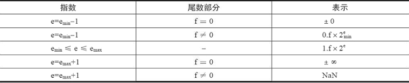

```c
浮点数表示[符号位,基数,指数]
    例：10进制中
        666.66=6.6666*10^2
        指数的作用就是移动小数点的位置

为了让上面的浮点表示成规范化统一表达的目标
    
    +-   d.dd......dx B^e  (0<=di<B)
    d.dd.... 表示有效数字  B表示基数，e,表示为指数


    p:有效数字的精度  
    +-(d0 +d1*B^-1+............d(p-1)B^-(p-1)) *B^e (0<=di<B)


例  1.234×10^1
    对于10进制的浮点数 可以表示为上面的 (1+2*10^-1+3*10^-2+4*10^-3)*10^1


对于二进制来说也可以进行上面的表示方法
    例 1001.101 
    1001+1*2^-1+0*2^-2+1*2^-3
    其规范浮点数表达为 1.001101×2^3

    下面我们把上面的二进制转化成10进制
        1001.101 
        =1*2^3+0*2^2+0*2^1+1*2^0+1*2^-1+0*2^-2+1*2^-3
        =8+0+0+1+1/2+0+1/3
        =9+5/8
        =9.625


  规律：二进制小数转化为10进制数最后一位必是5

    二进制小数           10进制
    0.1=2^-1              0.5
    0.01=2^-2               0.25
       ..............


    0.00000000=2^-8      0.00390625


一段c语言验证


#include <stdio.h>
int main(void)
{
    float f1=34.6;
    float f2=34.5;
    float f3=34.0;
    printf("34.6-34.0=%f\n",f1-f3);
    printf("34.5-34.0=%f\n",f2-f3);
    return 0;
}


运行结果为：
34.6-34.0=0.599998
34.5-34.0=0.500000


34.6-34.0=0.599998 这个答案按照数学知识是错误的答案应该是 0.6
造成这个的原因是？？？？？？
    根据上面的我们知道因为我们不管是整数和浮点数都是保存的是二进制所以浮点数的二进制转化为10进制最后一位都是5(准确)

    34.6 保存到内存里面否浮点数根本不是准确的数，所以计算出来的数根本就不能是准确的数


把10进制浮点数转化成二进制的浮点数
       13.125 转换成二进制数如下：
    方法整数和小时分开
    13  转化为二进制位11.1
    0.125 (小数部分x2取整数位)
        0.125 x 2=0.25    整数位0
        0.25*2 =0.5  整数位 0
        0.5 *2=1  1 
        小数部分001

    所以二进制的浮点数的表示为   用规范浮点数表达为 1.101001*2^3。


```


## 浮点数表示法

图一


图二

```c

V=（-1）^S×M×2^E，

符号位 s（Sign）决定数是正数（s＝0）还是负数（s＝1），而对于数值 0 的符号位解释则作为特殊情况处理。


有效数字位 M（Significand）是二进制小数，它的取值范围为 1~2-ε，或者为 0~1-ε。它也被称为尾数位（Mantissa）、系数位（Coefficient），甚至还被称作“小数”。


指数位 E（Exponent）是 2 的幂（可能是负数），它的作用是对浮点数加权。

     
    图二
    1) 格式化值(bit不能全为0也不全为1)
        E 单精度 最大 255 2^8-1 (8为全为1)


        E双精度  最大 2047 2^12-1 (12位全为1) 


    指数可以为+也可以为-，为了解决这个问题  实际的字需要加上一个偏值

    偏值为  2^bits -1
            bits 表示的是指数的位数-1

        单精度偏值 2^(8-1)-1=127
            指数的取值范围是 1-127=-126
                            254-127=127
                            [-126,127]    
                                
        双精度 2^(12-1)-1023

            双精度的计算和上面的类似


    小数段 frac
        f 取值 0<f<1  二进制表示为 0.f0 f1 f2......
        M=1+f  1<M<2  (这种方式叫做隐含以1开头的表示法)
        M=1.fn-1  fn-2.....

    二进制的 1001.101（即十进制的 9.625）可以表达为 1.001101×2^3，所以实际保存在有效数字位中的值为
        在M里面实际表示为
            00110100000000000000000
            001101  
            1001101 这个才是真实的数但是放到M里面1是不写的    


    根据上面的规则我们来计算一下  -9.625
        二进制为 1001.101
        为负数符号位为1

        指数为 1.001101*2^3  E的真实数为 3+127=130 二进制位 10000010

        1         10000010  001 1010 0000 0000 0000 
        符号位     指数为     小数位

        16进制表示下面的数据

             1100 0001 0001 1010 0000 0000 0000 
               c     1     1     a     0     0     0
             0x c11a000


2) 特殊数值 (图三)
    NaN:
        当指数段全为如图四那样就认为是NaN

        sign 11111111   .............

    一般情况下，我们将 0/0 或: 根号-1视为计算终止的不可恢复的错误，但是在有一些计算视为是有意义的所以我们就返回NaN


    图5就这告诉我们有那些情况会返回NaN


3) 非格式化值
    当指数全为0的时候表示为非格式化如图六表示的那样

     sign 00000000 ..........
     这种情况 指数 E=1-BITS  有效数字  M=f  也就是说他是小数段不+1


    非格式化的用途：
        指数为全部为0的时候表示非格式化
        图6就表示非格式化

        非格式化就说 M 小数位不许用+1

        用途
            1.可以表示浮点数0.0
            sign 0000 0000 000 0000 0000 0000 0000
            计算 (-1)^sign* 0*2(-126)==0
                 为什么会等于0 是因为 非格式化小数没有隐含的开头

            2.可以无限表示接近0的数

    图7


```


图三



图四


图五


图六


图七


## 标准浮点格式

```c 
单精度浮点格式（32 位）。
双精度浮点格式（64 位）。
扩展单精度浮点格式（≥43 位，不常用）。
扩展双精度浮点格式（≥79 位，一般情况下，Intel x86 结构的计算机采用的是 80 位，而 SPARC 结构的计算机采用的是 128 位）。


图8表示可单精度的浮点格式


  8.25 在32位单精度的存储方式

  转换为二进制
  1000.01
  1.00001*2^3

  指数值为 3+127=130   

  0   1000 0010  000 1000 0000 0000 0000 0000

  符号位   指数为   小数位


   


下面的讨论略！！！！！
双精度浮点格式（64 位）。
扩展单精度浮点格式（≥43 位，不常用）。
扩展双精度浮点格式（≥79 位，一般情况下，Intel x86 结构的计算机采用的是 80 位，而 SPARC 结构的计算机采用的是 128 位）。

```

图八


## 舍入误差

```
概念:
    舍入误差是指运算得到的近似值和精确值之间的差异
    IEEE 浮点格式定义了 4 种不同的舍入方式，如下表所示。其中，默认的舍入方法是向偶数舍入，而其他三种可用于计算上界和下界。
                图九

 图十说明了这四种取舍的的演示


 为什么要使用向偶数取舍而不是用我们学习的四舍五入？？？？？？？
        四舍五入  小数后 1234 舍掉    56789 入  这样的话入的数字就要多一个数，在进行大量的统计下出现的偏差就会变大  偶数取舍  5这个数的取舍的概率差不多这样计算的话出现的偏差响应的要小一些

   

怎样进行向偶数进行取舍？？？？(round to even)
           .001 1001  保留3位
        1001 大于 0.5 入 +1
        0111 小于 0.5 舍 直接截断

        1000 等于 0.5  最低0 截断 最低位 1  就进1凑成0 


        例    二进制  保留小数后3位 

        1.0011001   1001 >0.5   得 1.010
        1.001011   0110 <0.5  得 1.001
        1.0011000  1000 ==0.5  最后有效位是 1 所以进1  得 1.010


              
    

    


1.0011000 

```


图九


图十


##  IEEE 754 还提出 5 种类型的浮点异常 ？？？？