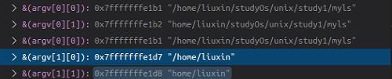

```
char  * c  和 char c[] 意义差不多
    c=数组头字母c =&c[0]


char * c[]  
    把 c[] 看成 A

    char * A = char A [];

    A=数组头字母 A =&(A[0])
    意义等效的

    c[0]=c[0]=&(c[0][0]) 

    c[0][0]就是一个char类型

    第一个坐标值代表的是第一个字符串或者说 char *  ,char[]  

    第二个坐标代表的是 char *  char数组 里面的具体char值  


    char[0][0] 地址  0x7fffffffe1b1 
    char[0][1] 地址  0x7fffffffe1b2   他们存储的数据是连续的


   

```

