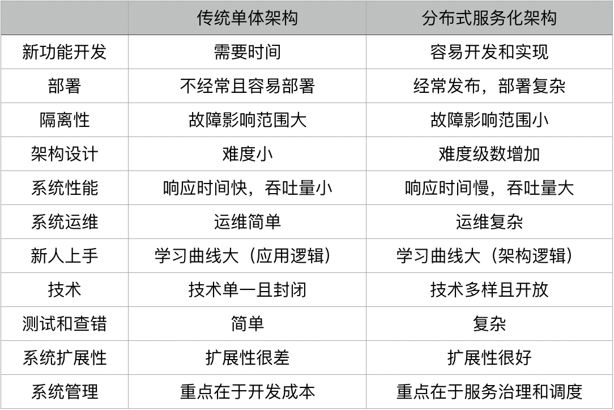

存在分布式架构的原因？
```
1.增大系统容量。我们的业务量越来越大，而要能应对越来越大的业务量，一台机器的性能已经无法满足了，我们需要多台机器才能应对大规模的应用场景。所以，我们需要垂直或是水平拆分业务系统，让其变成一个分布式的架构。


2.加强系统可用。我们的业务越来越关键，需要提高整个系统架构的可用性，这就意味着架构中不能存在单点故障。这样，整个系统不会因为一台机器出故障而导致整体不可用。所以，需要通过分布式架构来冗余系统以消除单点故障，从而提高系统的可用性。

```

传统单体和微服务项目的优缺点




```
从上面的表格我们可以看到，分布式系统虽然有一些优势，但也存在一些问题。
1.架构设计变得复杂（尤其是其中的分布式事务）。
2.部署单个服务会比较快，但是如果一次部署需要多个服务，流程会变得复杂。
3.系统的吞吐量会变大，但是响应时间会变长。
4.运维复杂度会因为服务变多而变得很复杂。架构复杂导致学习曲线变大。
5.测试和查错的复杂度增大。技术多元化，这会带来维护和运维的复杂度。
6.管理分布式系统中的服务和调度变得困难和复杂。


微服务解决了单点和性能容量的问题但是却增加了一堆的问题
```


SOA
```
什么是SOA?
    SOA 架构是构造分布式计算应用程序的方法。
    它将应用程序功能作为服务发送给最终用户或者其他服务。它采用开放标准与软件资源进行交互，并采用标准的表示方式。


SOA的几条基本原则
        可重用，粒度合适，模块化，可组合，构件化以及有互操作性
        符合开放标准（通用的或行业的）。
        服务的识别和分类，提供和发布，监控和跟踪。
```

SOA 架构的演化图


```
说明上图

1990 
    20 世纪 90 年代前，是单体架构，软件模块高度耦合。当然，这张图同样也说明了有的 SOA 架构其实和单体架构没什么两样，因为都是高度耦合在一起的。

2000
    而 2000 年左右出现了比较松耦合的 SOA 架构，这个架构需要一个标准的协议或是中间件来联动其它相关联的服务（如 ESB） 
    服务之间不进行直接依赖通过中间件进行或者通信框架进行依赖，这些就是ioc,和dip(依赖导致)设计思想在架构中的实现

2010 
    而 2010 年后，出现了微服务架构，这个架构更为松耦合。每一个微服务都能独立完整地运行（所谓的自包含），后端单体的数据库也被微服务这样的架构分散到不同的服务中。而它和传统 SOA 的差别在于，服务间的整合需要一个服务编排或是服务整合的引擎


但是在集成测试、运维和服务管理等方面就比较麻烦了。所以，需要一套比较好的微服务 PaaS 平台
Pass 的意思  Platform-as-a-service  平台服务
    
```
[编排和组织引擎可以是工作流引擎资料](https://martinfowler.com/articles/microservices.html)


### 微服务的难点
    