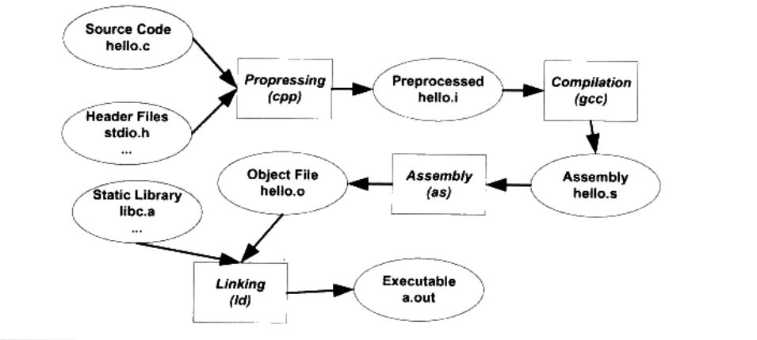

```
gcc main.c
./main.out

包含4个过程
    预处理
    编译
    汇编
    链接
```


gcc build(构建)的4个过程解释
### 预编译
```
   源文件的头文件进行一个编译
   例：
        main.c 文件用了头文件 stdio.h,stido.h会预编器编译成一个 stdio.i的文件


        gcc -E  hello.c -o hello.i
        cpp xxx.c  >xxx.i

    预编译过程主要做的事情
        1.#define 删除 并把所有定义的宏展开替换
        2.处理所有条件预编译指令 #if #ifndef ....
        3.处理#include 把包含的文件插入到当前预处理器的位置(递归，可能包含里面还有包含)
        4.删除所有的注释 // 和 /**/
        5.添加行号和文件名标识 比如 #2 "hello.c" 2 这样做主要用于编译报错警告打印相关信息
        6.保留所以的#pragma 编译器指令，因为编译器要使用

xxx.i文件是经过预编译的文件里面所有的预编译指令都被展开 包含条件 预处理指令。
这个文件也可以检查预处理条件和预处理指令是否正确
```

### 编译
```
就是把预处理完的文件进行一系列词法分析，语法分析，语义分析和优化后生产的汇编代码文件文件。

gcc -S hello.i -o hello.s

hello.s 就是汇编输出文件


main.s代码(gcc编译成汇编代码)
        .file   "main.c"
        .section        .rodata
.LC0:
        .string "hello world"
        .text
        .globl  main1
        .type   main1, @function
main1:
.LFB0:
        .cfi_startproc
        pushq   %rbp
        .cfi_def_cfa_offset 16
        .cfi_offset 6, -16
        movq    %rsp, %rbp
        .cfi_def_cfa_register 6
        movl    $.LC0, %edi
        movl    $0, %eax
        call    printf
        movl    $0, %eax
        popq    %rbp
        .cfi_def_cfa 7, 8
        ret
        .cfi_endproc
.LFE0:
        .size   main1, .-main1
        .ident  "GCC: (GNU) 4.8.5 20150623 (Red Hat 4.8.5-39)"
        .section        .note.GNU-stack,"",@progbits

```

### 汇编

```
汇编器是将汇编代码转变为机器可以执行的命令
```