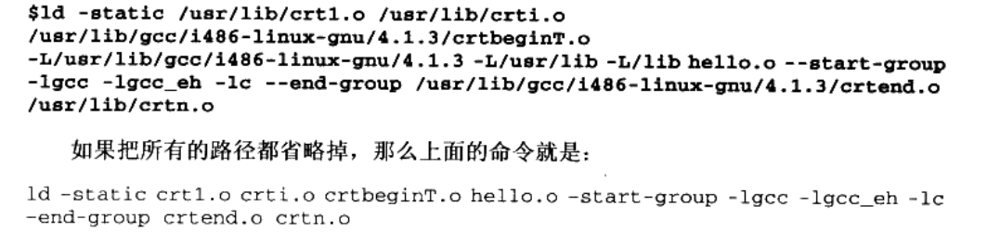
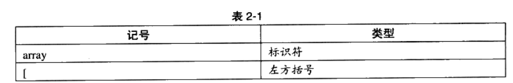
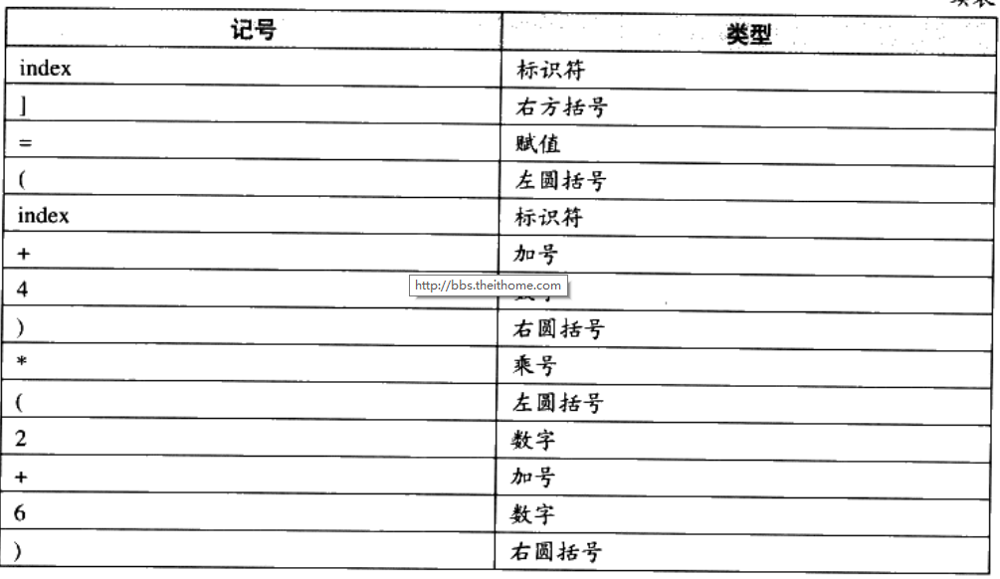
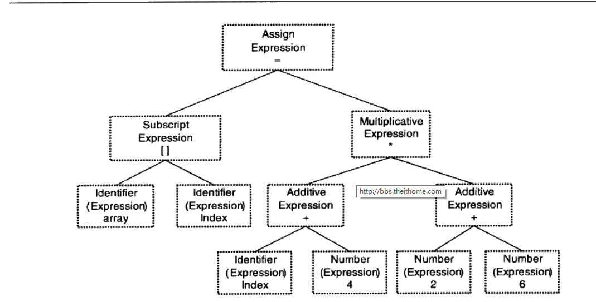
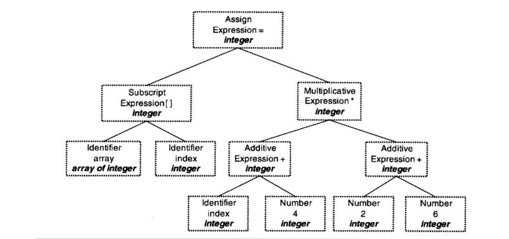
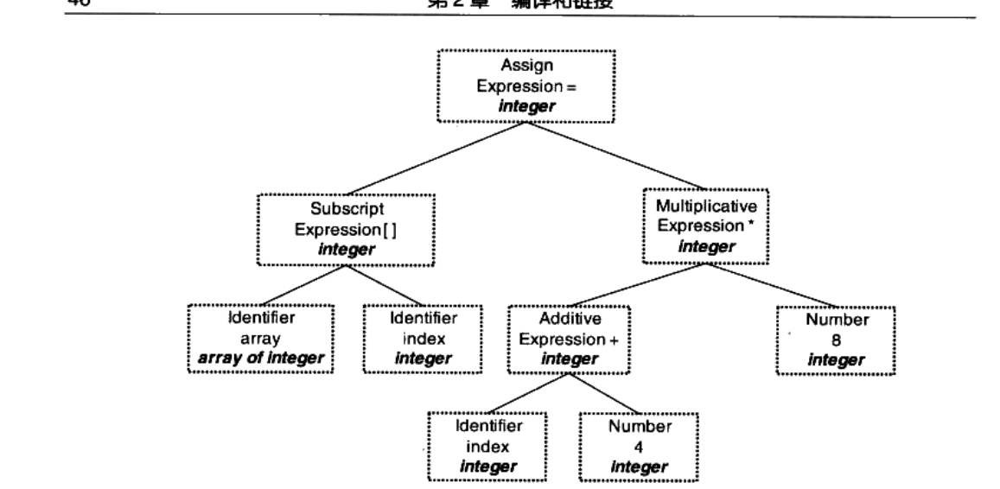
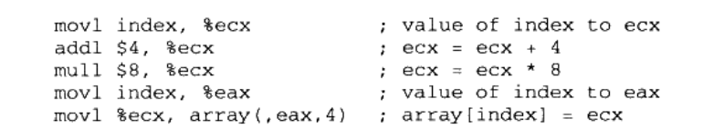
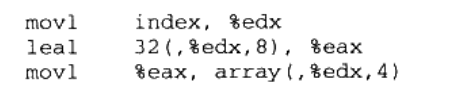
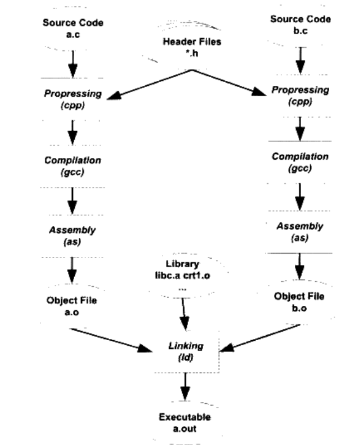

```
gcc main.c
./main.out

包含4个过程
    预处理
    编译
    汇编
    链接
```
hello.c
```c
#include <"stdio.h">
int main(){
   printlf("hello word \n");     
   return 0;
}
```
编译过程图示


gcc build(构建)的4个过程解释
### 预编译
```

   源文件的头文件进行一个编译
   例：
        main.c 文件用了头文件 stdio.h,stido.h会预编器编译成一个 stdio.i的文件


        gcc -E  hello.c -o hello.i
        cpp xxx.c  >xxx.i

    预编译过程主要做的事情
        1.#define 删除 并把所有定义的宏展开替换
        2.处理所有条件预编译指令 #if #ifndef ....
        3.处理#include 把包含的文件插入到当前预处理器的位置(递归，可能包含里面还有包含)
        4.删除所有的注释 // 和 /**/
        5.添加行号和文件名标识 比如 #2 "hello.c" 2 这样做主要用于编译报错警告打印相关信息
        6.保留所以的#pragma 编译器指令，因为编译器要使用

xxx.i文件是经过预编译的文件里面所有的预编译指令都被展开 包含条件 预处理指令。
这个文件也可以检查预处理条件和预处理指令是否正确
```

### 编译
```
就是把预处理完的文件进行一系列词法分析，语法分析，语义分析和优化后生产的汇编代码文件文件。

gcc -S hello.i -o hello.s

hello.s 就是汇编输出文件


main.s代码(gcc编译成汇编代码)
        .file   "main.c"
        .section        .rodata
.LC0:
        .string "hello world"
        .text
        .globl  main1
        .type   main1, @function
main1:
.LFB0:
        .cfi_startproc
        pushq   %rbp
        .cfi_def_cfa_offset 16
        .cfi_offset 6, -16
        movq    %rsp, %rbp
        .cfi_def_cfa_register 6
        movl    $.LC0, %edi
        movl    $0, %eax
        call    printf
        movl    $0, %eax
        popq    %rbp
        .cfi_def_cfa 7, 8
        ret
        .cfi_endproc
.LFE0:
        .size   main1, .-main1
        .ident  "GCC: (GNU) 4.8.5 20150623 (Red Hat 4.8.5-39)"
        .section        .note.GNU-stack,"",@progbits

```

### 汇编

```
汇编器是将汇编代码转变为机器可以执行的命令
        汇编器不像编器器那样复杂词法分析等，他就是把汇编指令翻译成计算机能认识的机器码

        as  xxx.s    -o  xxx.o

        获取

        gcc -c hello.s -o hello.o

        gcc -c  其实也能直接重  .c文件 通过预编译 编译 汇编直接生成目标文件(xxx.o)的
        文件


```


### 链接

怎样链接才能使helloword程序跑起来


###  后面的知识是对前面图片的解释

#### 编译器做了什么
```
定义： 编译器将高级语言编译成机器语言的一个工具

从源代码到目标文件编译器需要做的事

1.扫描
2.语法分析
3.语义分析
4.源代码优化
5.代码生成
6.目标代码优化


例子
        array [index]=(index+4)*(2+6);
        XXX.c文件的代码


        1.首先被输入到扫描器
                进行简单的词法分析运用一种有限状态机的算法轻松将源代码字符序列分隔成记号（TOKEN）

                
```





#### 词法分析
```


上面的者两个图片就是编译器扫描并进行简单的词法分析并通过有限状态机的算法做标记的结果


词法分析产生的记号分类
        关键字
        标识符
        字面量(数字，字符串)，特殊符号（加号，等号）

扫描词法分析的同时编译器会把标识符放到符号表，把数字和字符串放到文字表


lex程序可以实现词法分析


c,c++这样有预编译的语言是预编译工作是不会交给编译器来做的，他是交给独立的预编译器来做


```


#### 语法分析

```
语法分析器（Gramar Parser） 分析扫描器词法分析后的记号的结果

语法分析器分析过后会产生语法树(Sybntx Tree)的结果

分析采用的手段是上下文无关语法（Context-free Grammer）


```

##### 上下文无关语法和自动机

```


```


语法树




```
语法分析器 有一个现成的工具 yacc


```


### 语义分析
```
编译器能进行的语义分析只能是静态语义(编译时就能确定比如只能不能和浮点数进行运算)


静态语义
        声明
        类型匹配
        类型的转换

        语义分析要做的就是类型的之间的转换，
        类型之间转换不匹配就要进行报错


```

语义分析在语法树上确定类型
也会更新扫表标记的符号表的符号类型



### 中间语言生成(源码级别的优化)
```
源码级优化器

        在源代码级别的优化
        以上面的代码为例  （2+6） 就可以在编译器被优化 直接等于8
```



源码优化器被优化的过程
```
        不会再语法数上被优化这样优化非常的困难
        源码优化器会将语法树变成中间代码(已经恒接近目标代码了)，他跟目标机器和运行时环境无关(不是汇编一些相关的东西)

        中间代码在不同的编译器表现出来的形式是不同的
        常见的形式
                1.三地址码
                        x =y op z
                        op  可以是运算操作符以及可以运算到一切的符号

                        语法树翻译三地址码可以是这样的
                        源代码
                                array [index]=(index+4)*(2+6);
                                
                                写成三地址码
                                        t1=2+6;
                                        t2=index+4
                                        t3=t2*t1;
                                        array[index]=t3; 

                                优化后会写成 
                                      t1 直接变成了8
                                      t2=index+4
                                      t3=8t2
                                      array[index]=8t2 

                2.P-代码


```

### 目标代码的生成和优化(从这开始这里已经是属于是编辑器后端做的事情了)

```
源代码优化器生成中间优化后的代码带表的是后面的所有的操作都属于是编辑器的后端


编辑器后端(包含)
        代码生成器
                作用：是将源代码优化器生成的中间代码转换为【目标机器代码】
                        这个过程会根据当前机器的不同生成不同目标的机器的代码
                        不同的机器字长，寄存器，整数类型，浮点数类型有着差异


        目标代码生成器
                目标代码优化的手段
                        1.选择合适的寻址方式
                        2.使用位移来代替乘除法
                        3.删除对于的指令
                        ......
```

这张图片是根据源码优化器优化出来的中间代码在经过代码生成器转化的目标机器代码(x86汇编)



目标代码优化器(对生面生成代码生成器生成的汇编代码进行优化)




## 链接器


### 模块拼装-静态链接
```
链接：将源代码多个源代码文件生成多个目标文件，在对多个目标文件进行组装成一个可执行的文件这个过程就叫做链接

```

链接过程需要做的事情
        地址和空间分配
        符号决议
        重定向


重编译到链接的过程



```
库文件
        其实就是一个基本函数的目标文件的文件夹


每个xxx.c文件是单独编译的
main.c (调用func.c foo()函数) 和 fun.c 文件（里面有一个foo()函数）

编译器在编译main.c 的时候并不知道foo()函数的地址，会先把这些调用foo()函数的目标地址搁置等待进行连接的时候将这些指令的目标地址进行修正


fun.c 有可能会被重新的编译，他的地址有可能改变，我们在main.c用到的foo()函数的地址会进行更正


```