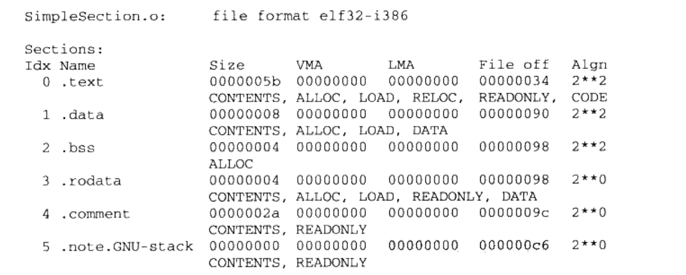

# 目标文件里面有什么

### 目标文件的格式
```
    采用elf文件标准的分类
        1可重定位文件 
            包含数据和代码，被连接起来生成可执行文件      linux x.o   win x.obj
        2可执行文件
           x.exe   liunx  /bin/bash文件等

        3共享目标文件
            包含数据和代码
            两种情况下可以使用
                连接器下使用
                    这种文件和共享目标文件产生新的目标文件
                动态连接器
                    将几个这种共享目标文件结合作为进程映像的一部分来运行
        4.核心转储文件
            进程意外终止将进程的一些信息和地址空间转储到核心的存储文件  
            （linux core dump）                      
```

```
在linux下使用file 命令查看相应的文件类型


[root@VM_0_4_centos text]# file liuxin (
liuxin: ELF 64-bit LSB executable该文件是一个可执行的文件), x86-64, version 1 (SYSV), dynamically linked (uses shared libs), for GNU/Linux 2.6.32, BuildID[sha1]=947a4fc4f06768bf90df6a8a23483dfa0f138698, not stripped

[root@VM_0_4_centos text]# file main.o
main.o: ELF 64-bit LSB relocatable(该文件是一个重定向的文件), x86-64, version 1 (SYSV), not stripped
```


### 目标文件是怎么样的

```
目标文件包含的东西
    编译后的指令代码和数据
     和一些链接必须要使用的信息
        符号表
        调试信息
        字符串

    这些信息按照Section(节)的形式进行存储


   程序进行编译后
        指令放在代码段  .code  或 .text

        全局变量和静态变量放在数据段里面 .data

```


图


假设上面的图编译后是可执行文件或者是目标文件文件的格式是elf

elf 开头是文件 file header 
    描述文件是否克是可执行文件，目标硬件和目标操作系统的描述
    还包含一个段表（section table）
        段表：描述文件中各个段的数组,描述了各个段在文件中的偏移位置和段的属性,重段表中可以得到每个段的所有信息

.text 机器码指令

.data 全局变量和静态变量

.bss 未初始化的全局变量和静态变量


分段机制的好处
    实现不同内存段的权限
        代码 读
        数据 读和写
    提高cpu缓存命中率
        cpu缓存一般被设计数据缓存和指令缓存

    3. 当我们打开多个同一程序的 时候 ，他们的指令都是一样的，在内存里只需要保存一份可修改的指令部分就可以了。（每个程序的继承保留自己私有改程序部分）
          这样做为我们解决了大量的空间
     查看进程相关信息软件
    https://docs.microsoft.com/zh-cn/sysinternals/downloads/process-explorer


### 挖掘SimpleSectin.o

```

.text 机器码指令

.data 全局变量和静态变量

.bss 未初始化的全局变量和静态变量

.rodata 只读数据段

 .comment 注释信息数据段


[root@VM_0_4_centos 01]# objdump -h app

app:     file format elf64-x86-64

Sections:
Idx Name          Size     VMA               LMA               File off  Algn
 13 .text         00000262  0000000000400430  0000000000400430  00000430  2**4
                  CONTENTS, ALLOC, LOAD, READONLY, CODE

Size:表示段的长度
FileOffset:段所在的位置

 CONTENTS, ALLOC....., 表示段的各种属性
    CONTENTS：表示该段在文件中存在


```




```
size 命令
    查看elf .data .text .bss 的长度
size app
   text    data     bss     dec(三个段的长度)    hex（长度的16进制） filename
   1524     544       8    2076     81c app
```


### 代码段

```
 objdump -s  -d app
    -s 将段里面的所有内容以16进制展示出来
    -d 将包含指令的段进行反汇编
```


#### 数据段和只读数据段

```
    .data (数据段)  保存的是局部静态变量和全局静态变量
    
    .rodata (只读数据段) 例 ：在c语言中变量被  const修饰


    

```

2.cpu的字节排序问题(大端和小段)

[资料](https://blog.erratasec.com/2016/11/how-to-teach-endian.html#.X9Wv16gzaHs)

```
    计算机硬件有两种存储方式，大端字节序和小端字节序
    大端字节序：高位字节在前，低位字节在后，这是人类读写数值的方法。
    小端字节序：低位字节在前，高位字节在后，即以0x1122形式储存。

1.首先，为什么会有小端字节序？

答案是，【计算机电路先处理低位字节，效率比较高，因为计算都是从低位开始的】。所以，计算机的内部处理都是小端字节序。

但是，人类还是习惯读写大端字节序。所以，除了计算机的内部处理，其他的场合几乎都是大端字节序，比如网络传输和文件储存。    


**计算机处理字节序的时候，不知道什么是高位字节，什么是低位字节。它只知道按顺序读取字节，先读第一个字节，再读第二个字节。

如果是大端字节序，先读到的就是高位字节，后读到的就是低位字节。小端字节序正好相反。

理解这一点，才能理解计算机如何处理字节序。**

   计算机根本不知道那个是高位  那个是低位  他只知道一个字节一个字节按顺序的读


字节序的处理，就是一句话：

"只有读取的时候，才必须区分字节序，其他情况都不用考虑。"

处理器读取外部数据的时候，必须知道数据的字节序，将其转成正确的值。然后，就正常使用这个值，完全不用再考虑字节序。

即使是向外部设备写入数据，也不用考虑字节序，正常写入一个值即可。外部设备会自己处理字节序的问题。   

cpu  从内存里面读取
    
    从小地址读到大地址
    
    ds+ip     ip 每读字节，会进行更新

    计算机内部使用的是小段模式（字节排序）
        OX000  0XAA   0X001 0X11

        第一个读取的是低位 第二个读取的是高位   合起来是 0x11aa


例
6.

举例来说，处理器读入一个16位整数。如果是大端字节序，就按下面的方式转成值。


x = buf[offset] * 256 + buf[offset+1];
上面代码中，buf是整个数据块在内存中的起始地址，offset是当前正在读取的位置。第一个字节乘以256，再加上第二个字节，就是大端字节序的值，这个式子可以用逻辑运算符改写。


x = buf[offset]<<8 | buf[offset+1];
上面代码中，第一个字节左移8位（即后面添8个0），然后再与第二个字节进行或运算。

如果是小端字节序，用下面的公式转成值。


x = buf[offset+1] * 256 + buf[offset];
32位整数的求值公式也是一样的。


/* 大端字节序 */
i = (data[3]<<0) | (data[2]<<8) | (data[1]<<16) | (data[0]<<24);

/* 小端字节序 */
i = (data[0]<<0) | (data[1]<<8) | (data[2]<<16) | (data[3]<<24);

```


### BSS段

```
存放的是未初始化的【全局变量和局部静态变量】


static int x1=0;
static int x2=1;

x1会被放入到.bss    x2会放到 .data
x1为什么被放入为初始化的.bss段
    x1=0 在没有被初始化的时候就会被默认的初始化为0，,你把它初始化为0会被编译器优化掉，放在.bss是不会存在在磁盘里面的这样就节约了磁盘的空间
```

### 自定义段

```
gcc  里面提供了指定属性放入到自定义的段

在全局变量和参数之前加上
__attribute__((section("xxx"))) int a=100;
__attribute__((section("xxx"))) int method(){

}
xxx  就是段的名字
```
