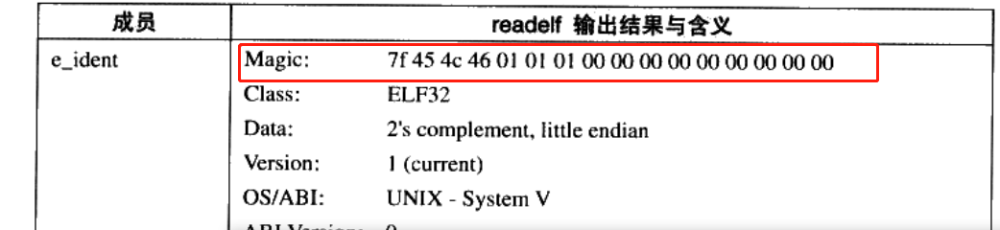
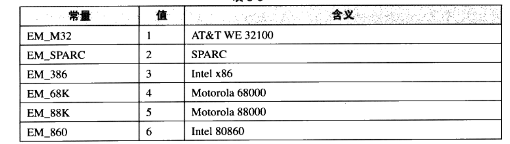

## elf文件的结构描述

### elf header 头文件
```
readelf -h xxxx.o

elf 文件头结构及相关常熟被定义在 /usr/include/elf.h里面

elf.h 头文件有两个版本 elf32_ehdr   elf64_ehdr

elf.h 里面的内容是通用的但是他们的大小存在差异 他们使用typedef 定义了一套自己的变量体系
    typedef  使用
    typedef 原来类型   新类型


```
elf 魔数
对应的是 elf.h里面的
```
typedef struct{
    unsigned char e_ident[16],
    Elf32_Half e_type; 文件类型
    Elf32_Half e_machine;  平台类型     
    ....
}
```


```
上面的16byte数据被用来标识elf文件的平台属性
    1.前4个byte 是所有elf文件都必须相同的  0x7f 0x45 0x4c 0x46
          7f 是ascii del控制符
          0x45 ascii E
          0x4c ascii L
          0x46 ascii F
    这四个字节又叫做elf的魔数 


    几乎所有的可执行文件格式开始的这几个字节都是魔数
       a.out   0x01 0x07
       pe/coff   0x4d 0x5a  (mz)
        
        操作系统在加载可执行文件的时候会确定魔数是否正确，来决定是否进行加载
    2.第5位
        0x01  标识32位
        0x02 表示64位


    3.第6位
        表示的是Order Byte
        规定elf文件数据排序是大端排序还是小端排序 
    4.第7位 elf文件的主版本号
        一般是1(elf 1.2版本之后就再也没有更新了)

    5.后面的字节是扩展的一般没有固定的含义(一般会填0)     
```

readelf -h main.o  查看目标文件 elf头信息
```
  Magic:   7f 45 4c 46 02 01 01 00 00 00 00 00 00 00 00 00 
  Class:                             ELF64
  Data:                              2's complement, little endian
  Version:                           1 (current)
  OS/ABI:                            UNIX - System V
  ABI Version:                       0
  Type:                              REL (Relocatable file)
  Machine:                           Advanced Micro Devices X86-64
  Version:                           0x1
  Entry point address:               0x0
  Start of program headers:          0 (bytes into file)
  Start of section headers:          848 (bytes into file)
  Flags:                             0x0
  Size of this header:               64 (bytes)
  Size of program headers:           0 (bytes)
  Number of program headers:         0
  Size of section headers:           64 (bytes)
  Number of section headers:         13
  Section header string table index: 12
```

文件类型
```
 e_type; 文件类型
Type: 表示的elf文件的类型
        ET_REL 1 重定向文件
        ET_EXEC 2 可执行文件
        ET_DYN 3 共享目标文件 一般为.so文件

```

机器类型
```
e_machine 表示的是平台机器的属性
```
