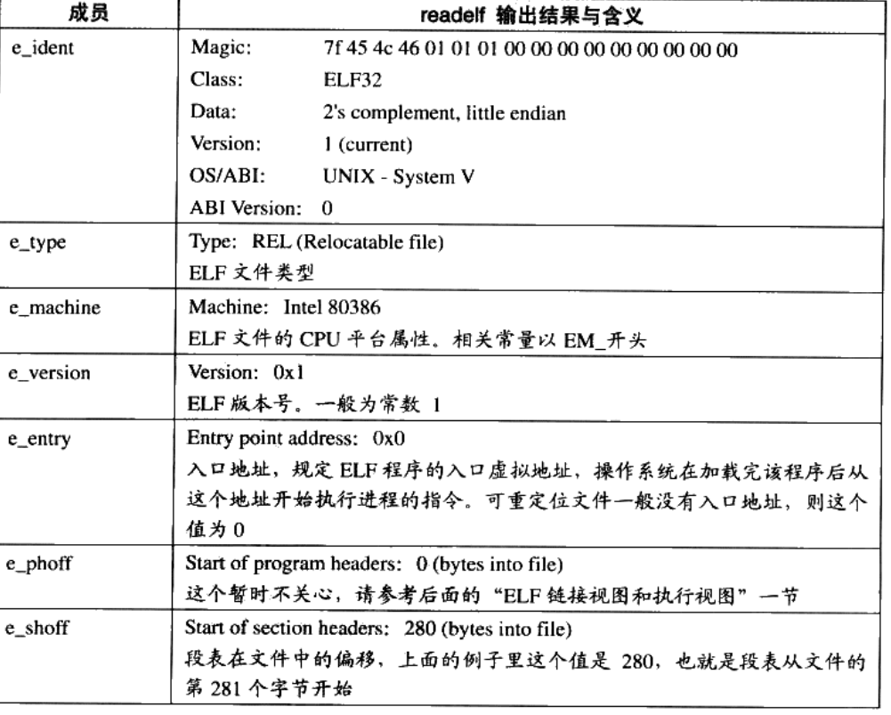
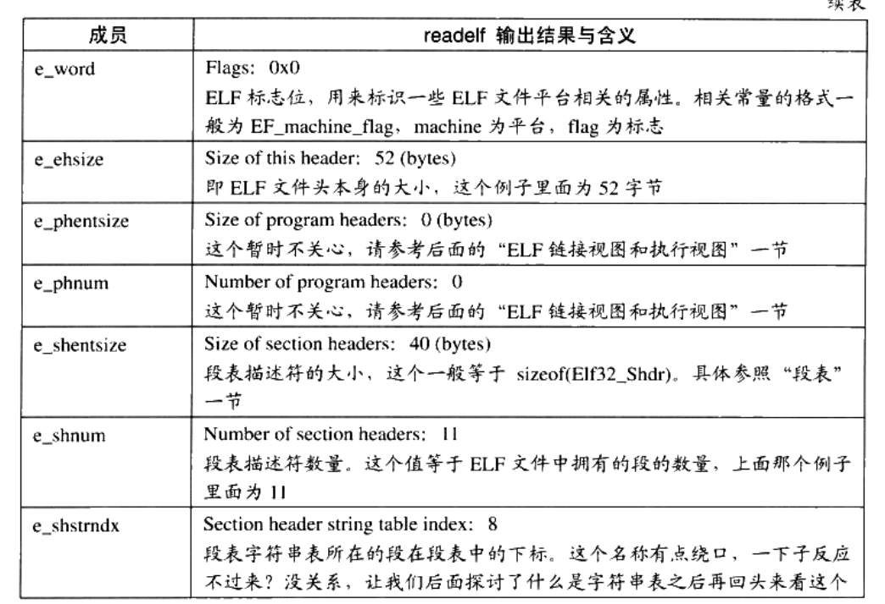

## elf文件的结构描述

### elf header 头文件
```
readelf -h xxxx.o

elf 文件头结构及相关常熟被定义在 /usr/include/elf.h里面

elf.h 头文件有两个版本 elf32_ehdr   elf64_ehdr

elf.h 里面的内容是通用的但是他们的大小存在差异 他们使用typedef 定义了一套自己的变量体系
    typedef  使用
    typedef 原来类型   新类型


```
elf 魔数
对应的是 elf.h里面的
```
typedef struct{
    unsigned char e_ident[16],
    Elf32_Half e_type; 文件类型
    Elf32_Half e_machine;  平台类型     
    ....
}
```


```
上面的16byte数据被用来标识elf文件的平台属性
    1.前4个byte 是所有elf文件都必须相同的  0x7f 0x45 0x4c 0x46
          7f 是ascii del控制符
          0x45 ascii E
          0x4c ascii L
          0x46 ascii F
    这四个字节又叫做elf的魔数 


    几乎所有的可执行文件格式开始的这几个字节都是魔数
       a.out   0x01 0x07
       pe/coff   0x4d 0x5a  (mz)
        
        操作系统在加载可执行文件的时候会确定魔数是否正确，来决定是否进行加载
    2.第5位
        0x01  标识32位
        0x02 表示64位


    3.第6位
        表示的是Order Byte
        规定elf文件数据排序是大端排序还是小端排序 
    4.第7位 elf文件的主版本号
        一般是1(elf 1.2版本之后就再也没有更新了)

    5.后面的字节是扩展的一般没有固定的含义(一般会填0)     
```

readelf -h main.o  查看目标文件 elf头信息
```
  Magic:   7f 45 4c 46 02 01 01 00 00 00 00 00 00 00 00 00 
  Class:                             ELF64
  Data:                              2's complement, little endian
  Version:                           1 (current)
  OS/ABI:                            UNIX - System V
  ABI Version:                       0
  Type:                              REL (Relocatable file)
  Machine:                           Advanced Micro Devices X86-64
  Version:                           0x1
  Entry point address:               0x0
  Start of program headers:          0 (bytes into file)
  Start of section headers:          848 (bytes into file)
  Flags:                             0x0
  Size of this header:               64 (bytes)
  Size of program headers:           0 (bytes)
  Number of program headers:         0
  Size of section headers:           64 (bytes)
  Number of section headers:         13
  Section header string table index: 12
```

### elf header信息说明



文件类型
```
 e_type; 文件类型
Type: 表示的elf文件的类型
        ET_REL 1 重定向文件
        ET_EXEC 2 可执行文件
        ET_DYN 3 共享目标文件 一般为.so文件

```

机器类型
```
e_machine 表示的是平台机器的属性
```


### 段表
```
段表示除了文件头以外最重要的结构(elf文件结构就是由段表决定的)
主要描述了
    段名
    段长
    在文件中的偏移
    读写权限
    以及段的其他属性


    编译器 连接器  装载器都是依靠段表来定位和访问各个段的属性的

      Start of section headers:          848 (bytes into file)  header里面的信息告诉我们段表从文件开始到第848byte 的地方就是段表开始的信息
```

app.o
```
[root@VM_0_4_centos 01]# readelf -S  app.o 
There are 21 section headers, starting at offset 0xc18:

Section Headers:
  [Nr] Name              Type             Address           Offset
       Size              EntSize          Flags  Link  Info  Align
  [ 0]                   NULL             0000000000000000  00000000
       0000000000000000  0000000000000000           0     0     0
  [ 1] .text             PROGBITS         0000000000000000  00000040
       00000000000000be  0000000000000000  AX       0     0     1
  [ 2] .rela.text        RELA             0000000000000000  00000730
       0000000000000198  0000000000000018   I      18     1     8
  [ 3] .data             PROGBITS         0000000000000000  00000100
       0000000000000004  0000000000000000  WA       0     0     4
  [ 4] .bss              NOBITS           0000000000000000  00000104
       0000000000000000  0000000000000000  WA       0     0     1
  [ 5] .rodata           PROGBITS         0000000000000000  00000104
       000000000000004c  0000000000000000   A       0     0     1
  [ 6] .debug_info       PROGBITS         0000000000000000  00000150
       0000000000000103  0000000000000000           0     0     1
  [ 7] .rela.debug_info  RELA             0000000000000000  000008c8
       0000000000000240  0000000000000018   I      18     6     8
  [ 8] .debug_abbrev     PROGBITS         0000000000000000  00000253
       0000000000000096  0000000000000000           0     0     1
  [ 9] .debug_aranges    PROGBITS         0000000000000000  000002e9
       0000000000000030  0000000000000000           0     0     1
  [10] .rela.debug_arang RELA             0000000000000000  00000b08
       0000000000000030  0000000000000018   I      18     9     8
  [11] .debug_line       PROGBITS         0000000000000000  00000319
       0000000000000053  0000000000000000           0     0     1
  [12] .rela.debug_line  RELA             0000000000000000  00000b38
       0000000000000018  0000000000000018   I      18    11     8
  [13] .debug_str        PROGBITS         0000000000000000  0000036c
       0000000000000119  0000000000000001  MS       0     0     1
  [14] .comment          PROGBITS         0000000000000000  00000485
       000000000000002e  0000000000000001  MS       0     0     1
  [15] .note.GNU-stack   PROGBITS         0000000000000000  000004b3
       0000000000000000  0000000000000000           0     0     1
  [16] .eh_frame         PROGBITS         0000000000000000  000004b8
       0000000000000038  0000000000000000   A       0     0     8
  [17] .rela.eh_frame    RELA             0000000000000000  00000b50
       0000000000000018  0000000000000018   I      18    16     8
  [18] .symtab           SYMTAB           0000000000000000  000004f0
       00000000000001f8  0000000000000018          19    14     8
  [19] .strtab           STRTAB           0000000000000000  000006e8
       0000000000000043  0000000000000000           0     0     1
  [20] .shstrtab         STRTAB           0000000000000000  00000b68
       00000000000000b0  0000000000000000           0     0     1
Key to Flags:
  W (write), A (alloc), X (execute), M (merge), S (strings), I (info),
  L (link order), O (extra OS processing required), G (group), T (TLS),
  C (compressed), x (unknown), o (OS specific), E (exclude),
  l (large), p (processor specific)


ELF64_shdr 结构体为元素的数组
/* Section header.  */

typedef struct
{
  Elf32_Word	sh_name;		/* Section name (string tbl index) */
  Elf32_Word	sh_type;		/* Section type */
  Elf32_Word	sh_flags;		/* Section flags */
  Elf32_Addr	sh_addr;		/* Section virtual addr at execution */
  Elf32_Off	sh_offset;		/* Section file offset */
  Elf32_Word	sh_size;		/* Section size in bytes */
  Elf32_Word	sh_link;		/* Link to another section */
  Elf32_Word	sh_info;		/* Additional section information */
  Elf32_Word	sh_addralign;		/* Section alignment */
  Elf32_Word	sh_entsize;		/* Entry size if section holds table */
} Elf32_Shdr;

typedef struct
{
  Elf64_Word	sh_name;		/* Section name (string tbl index) */
  Elf64_Word	sh_type;		/* Section type */
  Elf64_Xword	sh_flags;		/* Section flags */
  Elf64_Addr	sh_addr;		/* Section virtual addr at execution */
  Elf64_Off	sh_offset;		/* Section file offset */
  Elf64_Xword	sh_size;		/* Section size in bytes */
  Elf64_Word	sh_link;		/* Link to another section */
  Elf64_Word	sh_info;		/* Additional section information */
  Elf64_Xword	sh_addralign;		/* Section alignment */
  Elf64_Xword	sh_entsize;		/* Entry size if section holds table */
} Elf64_Shdr;

上面这两个结构体数组分别表示存储32位和64位段表的信息

Elf64_Shdr  array []=xxx
数组的个数表示了段的个数


```