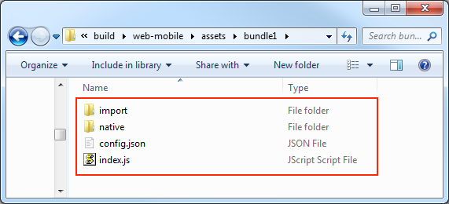

## Asset Bundle

### 配置
```
Bundle 名称  build 之后默认就是这个名字
Bundle 优先级 
    需要注意：这里的优先级从大到小的顺序构建  最大为10 
    BundleA  BundleB 都依赖资源c
        BundleA >  BundleA 
                BundleA 先构建会把资源依赖资源赋值到BundleA
                而BundleB只会记录一条记录
                当BundleB 要是用  资源c 或者其他地方要用到资源C一定要确保BundleA先加载

        BundleA=BundleB 那么资源c会在两个Bundle都赋值一个这个资源
        而这样也就失去了分包使用Bundle的用意


压缩类型
    默认：
        互依赖的资源的 JSON 文件合并在一起，从而减少运行时的加载请求次数
    无压缩：
        无任何压缩操作
    合并所有 JSON：
        把所有的json压缩成一个文件
        improt 文件夹下和并成一个文件夹所有的json和并成一个json文件
    小游戏分包：
        会将 Asset Bundle 设置为对应平台上的分包
    Zip：       
        部分小游戏平台资源压缩成zip减少加载次数

配置为远程包
    不支持Web
    会放到打包根目录的remote 里面 我们将整个包放入到server 
    勾选了这个不会打包到rpk中


```


### 加载 Asset Bundle
```js

cc.assetManager.loadBundle("配置面板的名称", (err, bundle) => {
    bundle.load('xxx');
});

// 当复用其他项目的 Asset Bundle 时
cc.assetManager.loadBundle("url地址", (err, bundle) => {
    bundle.load('xxx');
});


当我们把他远程的时候这些Bundle可以复用
    loadBundle传入的参数必须是url


 bundle.load('xxx');  这个用法就和cc.resources.load()一样的用法了    


v2.4.3 版本开始
    支持用户空间加载Bundle
    1. 先用对应平台的接口把资源下载到用户空间
    2.加载资源

    native 平台
    cc.assetManager.loadBundle(jsb.fileUtils.getWritablePath() + '/pathToBundle/bundleName', (err, bundle) => {
    // ...
    });


    微信平台

    cc.assetManager.loadBundle(wx.env.USER_DATA_PATH + '/pathToBundle/bundleName', (err, bundle) => {
    // ...
    });

    
``` 


注意：在配置 Asset Bundle 时，若勾选了 配置为远程包，那么构建时请在 构建发布 面板中填写 资源服务器地址


### Asset Bundle 的版本

```js
当你需要更新远程服务器上的 Asset Bundle 时 请在 构建发布 面板中勾选 MD5 Cache 选项，此时构建出来的 Asset Bundle 中的 config.json 文件名会附带 Hash 值。如图所示：


    我们什么也不用管Setting.js已经做了这件事情了,里面的文件已经配置了

    window._CCSettings = {
    platform: "web-mobile",
    groupList: [
        "default"
    ],
    collisionMatrix: [
        [
            true
        ]
    ],
    hasResourcesBundle: true,
    hasStartSceneBundle: false,
    remoteBundles: [],
    subpackages: [],
    launchScene: "db://assets/loading/loading.fire",
    orientation: "",
    debug: true,
    jsList: [
        "assets/scripts/Lib/Fetch.4e855.js",
        "assets/scripts/Lib/kkengine/kkengine.88520.js",
        "assets/scripts/Lib/runtime.e0906.js"
    ],
    bundleVers: {
        internal: "fa3fa",
        game: "6cc0d",
        fonts: "4c967",
        resources: "af9d6",
        main: "c9105"
    }
};


```


### 加载 Asset Bundle 中的资源

```js
bundle.load 


bundle.loadDir


加载场景
bundle.loadScene('test', function (err, scene) {
    cc.director.runScene(scene);
});

```


注意：在资源加载完成后，所有的资源都会被临时缓存到 cc.assetManager 中，以避免重复加载

###   释放 Asset Bundle 中的资源

```js
三种释放的方法
bundle.load(`image`, cc.SpriteFrame, function (err, spriteFrame) {
     cc.assetManager.releaseAsset(spriteFrame);
 });


bundle.load(`image`, cc.SpriteFrame, function (err, spriteFrame) {
     bundle.release(`image`, cc.SpriteFrame);
 });


释放所有的资源
bundle.load(`image`, cc.SpriteFrame, function (err, spriteFrame) {
     bundle.releaseAll();
 });


```
注意：在释放资源时，Creator 会自动处理该资源的依赖资源，开发者不需要对其依赖资源进行管理。

[释放资源详细内容](https://docs.cocos.com/creator/manual/zh/asset-manager/release-manager.html)


### 移除 Asset Bundle

```
为什么需要移除AssetBundle?
    加载使用之后永远不会使用该资源


在加载了 Asset Bundle 之后，此 bundle 会一直存在整个游戏过程中，除非开发者手动移除。当手动移除了某个不需要的 bundle，那么此 bundle 的缓存也会被移除，如果需要再次使用，则必须再重新加载一次。


let bundle = cc.assetManager.getBundle('bundle1');
cc.assetManager.removeBundle(bundle);


```


加载内置 Asset Bundle 


```js
第二种方式

勾选构建平台上
settings.js
  server: "http:www.baidu.com",
  cc.assetManager.init({
    bundleVers: settings.bundleVers,
    subpackages: settings.subpackages,
    remoteBundles: settings.remoteBundles,
    server: settings.server,
    subContextRoot: settings.subContextRoot
  });

    cocos打包已经帮我们配置进去


let bundleRoot = [];
// 加入 internal bundle 的 URL 地址
bundleRoot.push('http://myserver.com/assets/internal');
// 如果有 resources bundle, 则加入 resources bundle 的 URL 地址
bundleRoot.push('http://myserver.com/assets/resources');
// 加入 main bundle 的 URL 地址
bundleRoot.push('http://myserver.com/assets/main');

var count = 0;
function cb (err) {
    if (err) {
        return console.error(err.message, err.stack);
    }
    count++;
    if (count === bundleRoot.length + 1) {
        cc.game.run(option, onStart);
    }
}

cc.assetManager.loadScript(settings.jsList.map(x => 'src/' + x), cb);

for (let i = 0; i < bundleRoot.length; i++) {
    cc.assetManager.loadBundle(bundleRoot[i], cb);
}

```


### Asset Bundle 的构造
```js
Asset Bundle 的构造 图

构建时Bundle里面的代码和资源进行一下的处理
    代码  根据发布平台合并成一个 index.js 或 game.js 从主包剔除
    资源   文件夹中的所有资源以及文件夹外的相关依赖资源都会放到 import 或 native 目录下

    资源配置：所有资源的配置信息包括路径、类型、版本信息都会被合并成一个 config.json 文件

```





###  Asset Bundle 中的脚本 

```js
   Asset Bundle 中包含脚本文件 会被全部打包到一个文件下  index.js  或main.js
   
 注意：
    游戏平台不允许加载远程脚本文件 reator 会将 Asset Bundle 的代码拷贝到 src/scripts 目录下，从而保证正常加载

    不同的 Bundle 文件建议不要相互引用，可能会找不到对应文件,
        建议使用类或变量全局命名空间这样就暴露，从而实现共享
 
 
 

```