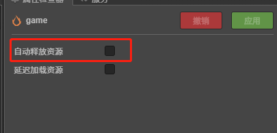
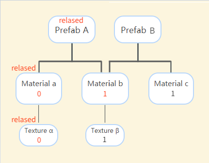

### 为什么需要释放资源？
```
在资源加载完成后，会被临时缓存到 cc.assetManager 中，以便下次复用。但是这也会造成内存和显存的持续增长。
```


### 自动释放
```
第一种:
场景可以直接设置为自动释放


勾选了场景的自动释放我们在切换场景的时候都会自动释放

建议在使用不频繁的场景都建议使用自动释放这样确保内存的占有降低


第二种:
    对cc.Asset资源的释放
    我们不用显示的调用资源资源释放接口，只需要维护资源的的引用技术Creator 会根据引用计数自动进行释放。这大大降低了错误释放资源的可能性


texture.addRef(); 加数
this.texture.decRef();


```



### 释放检查
```
1.cocos 检查到计数为0且没有其他的地方引用他，cocos会直接把他从内存里面移除

2.。。。。。。。。。。。。
。。。。。。。。。。。。。。。
```


### 手动释放
```js
cc.assetManager.releaseAsset(texture);
```


## 资源引用

### 静态引用
```
什么是静态引用？
    简单的来说，场景，预制体，材质账面的资源音乐等cocos可以根据序列化数据知道的资源这些就叫做静态引用


```




```js
    assetBundle 先加载预制体A,在加载预制体B
    prefebA:
         找到依赖资源个依赖资源的计数+1
         材料a 1
         textture a=1
         材料 b+1;
         textture b=1


    同样的加载prefebB
             textture b=1+1=2;  是因为他们共同引用b


    当我们释放资源A  依赖的资源-1


      材料 a=0
      textturea=0;
      材料 b=2+1=1

      所以计数为0的资源会被释放


```


### 资源的动态引用

```js
  什么是动态引用？？
     简单的来说就是通过代码加载资源设置到场景组件的。该资源并不会记录序列化的数据


   没够做任何操作的化
    引擎不会做特殊处理，SpriteFrame 的引用计数仍保持 0


如果动态加载出来的资源需要长期引用、持有，或者复用时，建议使用 addRef 接口手动增加引用计数。例如：


   cc.resources.load('images/background', cc.SpriteFrame, function (err, spriteFrame) {
    self.getComponent(cc.Sprite).spriteFrame = spriteFrame;
    spriteFrame.addRef();
    })


移除引用计数

    增加引用计数后，可以保证该资源不会被提前错误释放。而在不需要引用该资源以及相关组件，或者节点销毁时，请 务必记住 使用 decRef 移除引用计数，并将资源引用设为 null

        this.spriteFrame.decRef();
        this.spriteFrame = null;
```